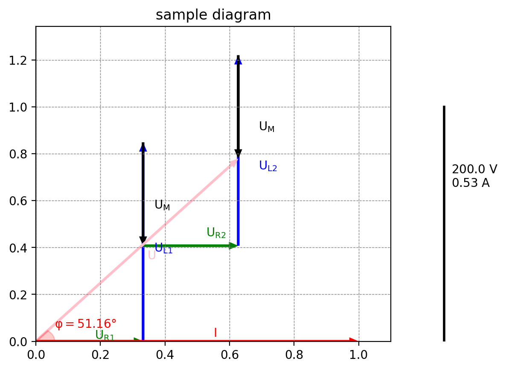

# phasors
Create phasor diagrams (relatively) easily.



## Using locally
Clone the repository
```bash
git clone https://github.com/k-wlosek/phasors.git
cd phasors
pip install -r requirements.txt
```
or use
```bash
pip install git+https://github.com/k-wlosek/phasors.git
```
to install the package.
Then, create a new Python file and create your diagram
```python
from phasors.symbol import Symbol
from phasors.diagram import Diagram

data = [
    [
        (66.48, 0, "U_R1", "green"),
        (169.67, 90, "U_L1", "blue"),
        (-88.2, 90, "U_M", "black"),
        (58.94, 0, "U_R2", "green"),
        (162.51, 90, "U_L2", "blue"),
        (-88.2, 90, "U_M", "black"),
        (200, 51.16, "U", "pink"),
        "V"
    ],
    [
        (0.53, 0, "I", "red"),
        "A"
    ]
]
phasors = Symbol.from_list(data)
d = Diagram(phasors, "title", [(0, 1, "red")])
d.create()
d.show()
```
Explanation:
- `data` is a list of lists representing symbols in the diagram
- `phasors` is a list of `Symbol` objects created from `data`
- `d` is a `Diagram` object created from `phasors`, "title" is the title of the diagram and `[(0, 1, "red)]` is a list of tuples representing which angles should the program draw (between which symbols). In this case, we want the angle to be drawn between the first (0) and the second (1) symbol and we want it to be red.
- `d.create()` creates the diagram
- `d.show()` shows the diagram

For other usages see `main.py` file.

### Data format
Data is a list of lists. Each list represents a symbol in the diagram. Each symbol is a list of tuples and strings. Tuples represent phasors and strings represent labels. Each tuple has 4 elements:
- length
- angle (in degrees)
- annotation
- color

**Important:** last phasor will always start from (0, 0), instead of the end of the previous phasor. This is useful for representing the sum of all phasors (for a symbol) in the diagram.

Last element in the list representing the symbol is a string representing the symbol's unit. Unit is important for annotating the scale.

It is also worth noting, that since it's common practise to use subscripts in annotations, you can easily do that by writing the annotation as `foo_bar`, where `bar` will be the subscript.

#### Example
```python
data = [
    [
        (66.48, 0, "U_R", "green"),
        (169.67, 90, "U_L", "blue"),
        (200, 51.16, "U", "pink"),
        "V"
    ],
    [
        (0.53, 0, "I", "red"),
        "A"
    ]
]
```
This will create a diagram with two symbols: `V` and `A`. `V` will have three phasors: `U_R`, `U_L` and `U`. `A` will have one phasor: `I`.
